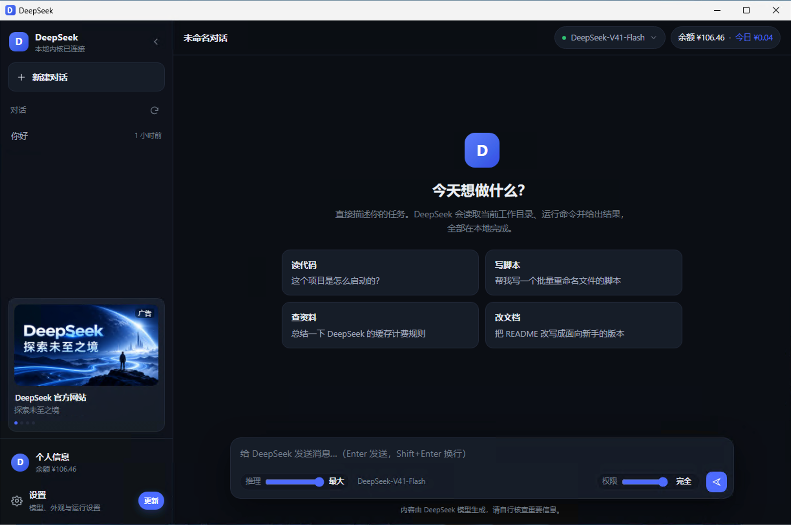
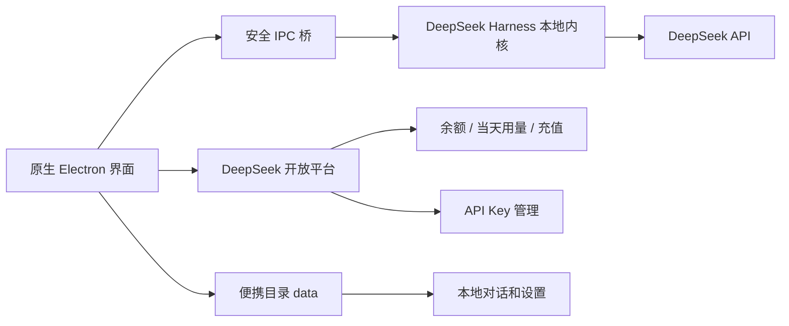

# DeepSeek Desktop

面向 Windows 用户的 DeepSeek 桌面客户端。它把 DeepSeek Harness、本地对话、账号余额、充值、API Key 和工具权限放进同一个原生界面，下载便携版后解压即可使用。

> 当前版本：**0.2.18** · Windows 10/11 x64 · 便携版

[从 GitHub 下载最新版](https://github.com/uulucky/deepseekdesktop/releases/latest/download/DeepSeekDesktop-0.2.18-portable.zip) · [从 img.uulucky.com 下载最新版](https://img.uulucky.com/han/deepseek/DeepSeekDesktop-0.2.18-portable.zip)



## 重点功能

- **余额和当天用量**：界面实时显示 DeepSeek 账户余额、当日费用、Token 和请求数，每 10 分钟自动刷新，也可以手动刷新。
- **软件内充值**：无需切换浏览器，在客户端中直接打开 DeepSeek 官方充值页面；登录完成后账户信息会立即同步。
- **滑动选择推理等级**：在输入框下方用滑块切换关闭、低、高、最大等等级，支持的档位会随当前模型自动调整。
- **滑动选择权限**：发送按钮左侧可切换 Read Only、Workspace Write、Full Access，让每个任务的文件和命令权限一目了然。
- **API Key 一站式配置**：登录后可以生成、粘贴、验证并写入本地内核；兼容旧内核，配置失败时不会丢失新生成的完整 Key。
- **本地对话与自动更新**：对话记录、登录状态和设置保存在便携目录的 `data` 中；更新后继续保留，发现新版本时可在软件内完成升级。

## 下载与使用

1. 下载 `DeepSeekDesktop-0.2.18-portable.zip`。
2. 完整解压到一个可写目录，例如 `D:\DeepSeekDesktop`。不要直接在压缩包预览窗口中运行。
3. 双击 `DeepSeek Desktop.exe`，也可以运行 `Run-DeepSeek.cmd`。
4. 第一次启动会准备本地运行组件，完成后进入主界面。

便携版不需要安装 Node.js 或 npm。配置、日志、登录状态和本地对话都在解压目录的 `data` 文件夹中；删除整个软件目录即可卸载。

Windows 可能因为程序暂未购买代码签名证书而显示“未知发布者”。请核对下载地址和校验值后，选择“更多信息 → 仍要运行”。

## 权限选择

| 档位 | 适合场景 | 能力 |
| --- | --- | --- |
| Read Only | 阅读、分析、回答问题 | 默认不修改工作区；需要写入时请求批准 |
| Workspace Write | 日常编程和文档修改 | 可写当前工作目录和临时目录 |
| Full Access | 明确信任的系统级任务 | 取消内核沙箱限制；启用前会再次确认 |

Full Access 不会绕过 Windows 账户权限或 UAC。仅在理解风险并信任当前任务时使用。

## 最新版本

**0.2.18**

- “关于”页面的服务来源改为项目 GitHub 仓库地址。
- 服务来源可以直接点击，在系统浏览器中打开源码与最新发布页面。

本仓库只提供当前版本，不保存历史安装包。软件内自动更新和两个下载入口始终指向最新版本。

## 架构



主要代码位于：

- `src/main/`：窗口生命周期、内核启动、平台接口、自动更新。
- `src/preload/`：主进程和界面的最小权限桥接。
- `src/renderer/`：聊天、设置、余额、推理与权限滑块界面。
- `build/`：便携包、原生更新器和发布清单构建脚本。
- `test/`：启动、平台、更新、聊天和凭据契约测试。

## 数据与隐私

- 登录状态、API Key 配置和对话数据保存在本机便携目录中。
- 余额、充值和 API Key 页面连接 DeepSeek 官方开放平台。
- 聊天请求由本地 Harness 发往用户选择的 DeepSeek 模型。
- 请勿把包含 `data` 文件夹的软件目录分享给他人。

## 从源码构建

需要 Node.js、npm、Go，以及已经准备好的 Windows x64 运行组件目录 `vendor/`。

```bash
npm install
npm test
npm run dist:portable
```

构建结果位于 `dist/`。仓库不提交 `vendor/`、`node_modules/`、`dist/` 和内部 `docs/`。

## 许可

本项目采用 [DeepSeek Desktop Personal Use License 1.0](LICENSE)，属于 **source-available（源码可查看）** 软件，并非 OSI 定义的开源软件。

- 自然人可以免费运行未修改的软件，用于个人、非商业用途。
- 公司、组织、工作用途、商业用途需要取得书面商业许可。
- 不允许修改、制作衍生版本或重新分发。

商业授权与问题反馈：`489583561@qq.com`

## 说明

DeepSeek Desktop 是独立的第三方桌面客户端，并非 DeepSeek 官方产品，也不代表 DeepSeek 官方背书。DeepSeek 名称、服务和相关权利归其各自权利人所有。
